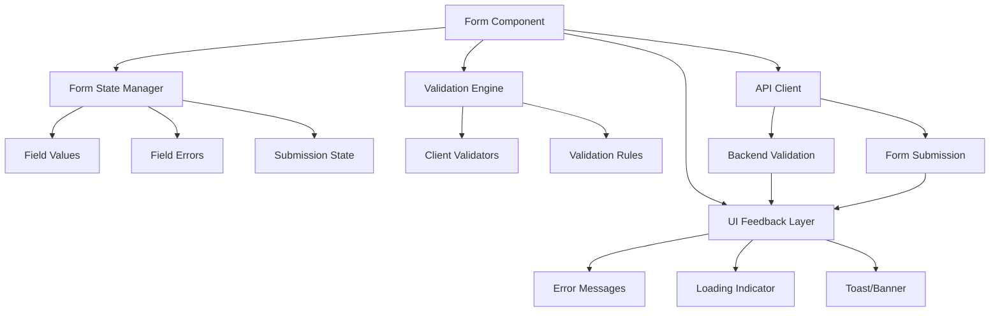
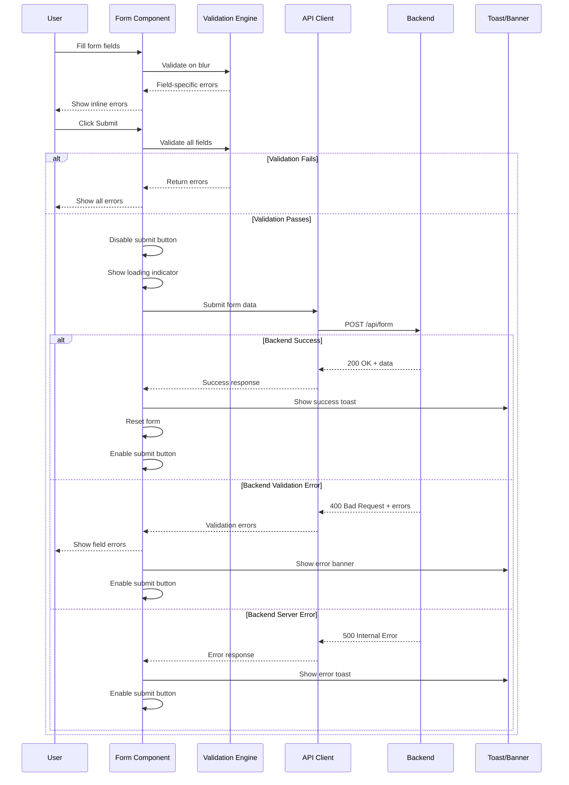

# Design Document: Multi-Field Form with Validation and User Feedback

## Overview

This feature implements a comprehensive multi-field form system with robust client-side and server-side validation, real-time user feedback, and proper submission handling. The form includes diverse input types (text, email, dropdown, date, file upload) with field-specific validation rules and clear error messaging. The system provides immediate visual feedback during validation, disables submission during processing, displays loading indicators, and shows success/error notifications via toast/banner components. The design emphasizes user experience through progressive enhancement, accessibility compliance, and defensive programming practices that never trust client-side data alone.

## Architecture

The form system follows a component-based architecture with clear separation of concerns between presentation, validation logic, submission handling, and user feedback.



## Sequence Diagrams

### Form Submission Flow




## Components and Interfaces

### Component 1: Form Component

**Purpose**: Main container component that orchestrates form rendering, state management, validation, and submission.

**Interface**:
```typescript
interface FormProps {
  onSuccess?: (data: FormData) => void;
  onError?: (error: Error) => void;
  initialValues?: Partial<FormData>;
}

interface FormData {
  fullName: string;
  email: string;
  country: string;
  dateOfBirth: string;
  phoneNumber: string;
  website: string;
  profileImage: File | null;
}

interface FormErrors {
  [key: string]: string;
}

interface FormState {
  values: FormData;
  errors: FormErrors;
  touched: { [key: string]: boolean };
  isSubmitting: boolean;
  submitCount: number;
}
```

**Responsibilities**:
- Manage form state (values, errors, touched fields, submission status)
- Coordinate validation on field blur and form submission
- Handle form submission with loading state management
- Render form fields with error messages
- Display toast/banner notifications for submission results


### Component 2: Validation Engine

**Purpose**: Centralized validation logic for all form fields with field-specific error messages.

**Interface**:
```typescript
interface ValidationRule {
  validate: (value: any, allValues?: FormData) => boolean;
  message: string | ((value: any) => string);
}

interface FieldValidation {
  [fieldName: string]: ValidationRule[];
}

interface ValidationEngine {
  validateField(fieldName: string, value: any, allValues?: FormData): string | null;
  validateForm(values: FormData): FormErrors;
  addRule(fieldName: string, rule: ValidationRule): void;
  removeRule(fieldName: string, ruleName: string): void;
}
```

**Responsibilities**:
- Define validation rules for each field type
- Execute validation logic and return field-specific error messages
- Support custom validation rules
- Handle complex validation scenarios (e.g., date range checks, file size limits)


### Component 3: Toast/Banner Notification

**Purpose**: Display temporary success/error messages to users after form submission.

**Interface**:
```typescript
type ToastType = 'success' | 'error' | 'warning' | 'info';

interface ToastProps {
  message: string;
  type: ToastType;
  duration?: number;
  onClose?: () => void;
}

interface ToastManager {
  showToast(message: string, type: ToastType, duration?: number): void;
  hideToast(): void;
  isVisible: boolean;
}
```

**Responsibilities**:
- Display toast notifications with appropriate styling based on type
- Auto-dismiss after configurable duration
- Support manual dismissal
- Queue multiple notifications if needed
- Provide accessible announcements for screen readers

### Component 4: API Client

**Purpose**: Handle HTTP communication with backend for form submission and server-side validation.

**Interface**:
```typescript
interface ApiResponse<T> {
  success: boolean;
  data?: T;
  errors?: FormErrors;
  message?: string;
}

interface ApiClient {
  submitForm(data: FormData): Promise<ApiResponse<any>>;
  uploadFile(file: File): Promise<ApiResponse<{ url: string }>>;
}
```

**Responsibilities**:
- Send form data to backend endpoint
- Handle file uploads with multipart/form-data
- Parse backend validation errors
- Handle network errors and timeouts
- Transform backend error format to frontend error format


## Data Models

### Model 1: FormData

```typescript
interface FormData {
  fullName: string;        // Required, 2-100 characters
  email: string;           // Required, valid email format
  country: string;         // Required, from predefined list
  dateOfBirth: string;     // Required, ISO date format, user must be 18+
  phoneNumber: string;     // Required, valid phone format
  website: string;         // Optional, valid URL format
  profileImage: File | null; // Optional, max 5MB, image types only
}
```

**Validation Rules**:
- `fullName`: Required, minimum 2 characters, maximum 100 characters, alphabetic characters and spaces only
- `email`: Required, must match email regex pattern, maximum 255 characters
- `country`: Required, must be one of the predefined country options
- `dateOfBirth`: Required, valid date, user must be at least 18 years old
- `phoneNumber`: Required, must match phone pattern (digits, spaces, dashes, parentheses)
- `website`: Optional, if provided must be valid URL with http/https protocol
- `profileImage`: Optional, if provided must be image type (jpg, jpeg, png, gif, webp), maximum 5MB

### Model 2: FormErrors

```typescript
interface FormErrors {
  fullName?: string;
  email?: string;
  country?: string;
  dateOfBirth?: string;
  phoneNumber?: string;
  website?: string;
  profileImage?: string;
  _form?: string;  // General form-level error
}
```

**Error Message Examples**:
- `fullName`: "Full name is required", "Full name must be at least 2 characters", "Full name can only contain letters and spaces"
- `email`: "Email is required", "Please enter a valid email address"
- `country`: "Please select a country"
- `dateOfBirth`: "Date of birth is required", "You must be at least 18 years old"
- `phoneNumber`: "Phone number is required", "Please enter a valid phone number"
- `website`: "Please enter a valid URL (must start with http:// or https://)"
- `profileImage`: "File size must be less than 5MB", "Only image files are allowed (jpg, png, gif, webp)"


### Model 3: FormState

```typescript
interface FormState {
  values: FormData;
  errors: FormErrors;
  touched: { [key: string]: boolean };
  isSubmitting: boolean;
  submitCount: number;
}
```

**State Transitions**:
- Initial state: All values empty/null, no errors, nothing touched, not submitting
- Field blur: Mark field as touched, validate field, update errors
- Field change: Update value, clear field error if previously invalid
- Submit attempt: Validate all fields, set submitCount, mark all as touched
- Submitting: Set isSubmitting to true, disable submit button
- Submit success: Reset form to initial state, show success toast
- Submit error: Set isSubmitting to false, update errors, show error toast

### Model 4: ValidationRule

```typescript
interface ValidationRule {
  validate: (value: any, allValues?: FormData) => boolean;
  message: string | ((value: any) => string);
}
```

**Rule Types**:
- Required: Checks if value is non-empty
- Pattern: Matches against regex
- Length: Validates string length (min, max)
- Range: Validates numeric range
- Custom: User-defined validation function


## Algorithmic Pseudocode

### Main Form Submission Algorithm

```typescript
async function handleSubmit(event: Event): Promise<void>
```

**Preconditions:**
- Form state is initialized
- All form fields have defined validation rules
- API client is configured with backend endpoint

**Postconditions:**
- If validation fails: errors are displayed, form remains editable
- If submission succeeds: form is reset, success toast is shown
- If submission fails: errors are displayed, form remains editable with data
- Submit button is always re-enabled after submission attempt

**Algorithm:**

```typescript
ALGORITHM handleFormSubmit(event)
INPUT: event (form submit event)
OUTPUT: void (side effects: state updates, API calls, UI updates)

BEGIN
  // Prevent default browser form submission
  event.preventDefault()
  
  // Step 1: Validate all fields client-side
  errors ← validateAllFields(formState.values)
  
  IF errors is not empty THEN
    // Mark all fields as touched to show errors
    FOR each field IN formState.values DO
      formState.touched[field] ← true
    END FOR
    
    formState.errors ← errors
    RETURN  // Exit early, don't submit
  END IF
  
  // Step 2: Set submitting state
  formState.isSubmitting ← true
  formState.submitCount ← formState.submitCount + 1
  
  TRY
    // Step 3: Submit to backend
    response ← await apiClient.submitForm(formState.values)
    
    IF response.success THEN
      // Success path
      showToast("Form submitted successfully!", "success")
      resetForm()
      IF onSuccess callback exists THEN
        onSuccess(response.data)
      END IF
    ELSE
      // Backend validation failed
      formState.errors ← response.errors
      showToast("Please correct the errors and try again", "error")
    END IF
    
  CATCH error
    // Network or server error
    IF error.status = 400 AND error.errors exists THEN
      // Backend validation errors
      formState.errors ← transformBackendErrors(error.errors)
      showToast("Please correct the errors and try again", "error")
    ELSE
      // General server error
      formState.errors._form ← "An error occurred. Please try again."
      showToast("Something went wrong. Please try again.", "error")
      IF onError callback exists THEN
        onError(error)
      END IF
    END IF
    
  FINALLY
    // Always re-enable submit button
    formState.isSubmitting ← false
  END TRY
END
```


### Field Validation Algorithm

```typescript
function validateField(fieldName: string, value: any, allValues?: FormData): string | null
```

**Preconditions:**
- `fieldName` exists in validation rules configuration
- `value` is the current field value (may be empty, null, or undefined)
- Validation rules are properly defined for the field

**Postconditions:**
- Returns `null` if field is valid
- Returns specific error message string if field is invalid
- Does not mutate input parameters

**Algorithm:**

```typescript
ALGORITHM validateField(fieldName, value, allValues)
INPUT: fieldName (string), value (any), allValues (FormData, optional)
OUTPUT: errorMessage (string | null)

BEGIN
  rules ← getValidationRules(fieldName)
  
  IF rules is empty THEN
    RETURN null  // No validation rules defined
  END IF
  
  // Execute each rule in sequence until one fails
  FOR each rule IN rules DO
    isValid ← rule.validate(value, allValues)
    
    IF NOT isValid THEN
      // Get error message (static or dynamic)
      IF rule.message is function THEN
        errorMessage ← rule.message(value)
      ELSE
        errorMessage ← rule.message
      END IF
      
      RETURN errorMessage
    END IF
  END FOR
  
  // All rules passed
  RETURN null
END
```

**Loop Invariants:**
- All previously checked rules have passed validation
- If any rule fails, algorithm returns immediately with error message
- Rules are checked in order of definition


### Complete Form Validation Algorithm

```typescript
function validateAllFields(values: FormData): FormErrors
```

**Preconditions:**
- `values` contains all form field data
- All fields have defined validation rules

**Postconditions:**
- Returns empty object if all fields are valid
- Returns object with error messages keyed by field name if any field is invalid
- Does not mutate input values

**Algorithm:**

```typescript
ALGORITHM validateAllFields(values)
INPUT: values (FormData object)
OUTPUT: errors (FormErrors object)

BEGIN
  errors ← {}
  
  // Validate each field in the form
  FOR each fieldName IN Object.keys(values) DO
    fieldValue ← values[fieldName]
    errorMessage ← validateField(fieldName, fieldValue, values)
    
    IF errorMessage is not null THEN
      errors[fieldName] ← errorMessage
    END IF
  END FOR
  
  RETURN errors
END
```

**Loop Invariants:**
- All previously validated fields have their errors (if any) recorded in errors object
- Validation of one field does not affect validation of other fields
- errors object accumulates all validation failures


### File Upload Validation Algorithm

```typescript
function validateFileUpload(file: File | null): string | null
```

**Preconditions:**
- `file` is either null (no file selected) or a File object
- Maximum file size and allowed types are configured

**Postconditions:**
- Returns `null` if file is valid or not provided (optional field)
- Returns specific error message if file violates size or type constraints
- Does not mutate file object

**Algorithm:**

```typescript
ALGORITHM validateFileUpload(file)
INPUT: file (File | null)
OUTPUT: errorMessage (string | null)

CONSTANTS:
  MAX_FILE_SIZE ← 5 * 1024 * 1024  // 5MB in bytes
  ALLOWED_TYPES ← ["image/jpeg", "image/jpg", "image/png", "image/gif", "image/webp"]

BEGIN
  // Optional field - null is valid
  IF file is null THEN
    RETURN null
  END IF
  
  // Check file size
  IF file.size > MAX_FILE_SIZE THEN
    RETURN "File size must be less than 5MB"
  END IF
  
  // Check file type
  IF file.type NOT IN ALLOWED_TYPES THEN
    RETURN "Only image files are allowed (jpg, png, gif, webp)"
  END IF
  
  // File is valid
  RETURN null
END
```


## Key Functions with Formal Specifications

### Function 1: handleFieldChange

```typescript
function handleFieldChange(fieldName: string, value: any): void
```

**Preconditions:**
- `fieldName` exists in FormData schema
- Form state is initialized

**Postconditions:**
- `formState.values[fieldName]` is updated with new value
- If field was previously invalid, error is cleared
- Form remains in editable state
- Other fields remain unchanged

**Implementation Notes:**
- Called on every keystroke/change event
- Optimistic update - clears error immediately
- Does not trigger validation (validation occurs on blur)

### Function 2: handleFieldBlur

```typescript
function handleFieldBlur(fieldName: string): void
```

**Preconditions:**
- `fieldName` exists in FormData schema
- Form state contains current field value

**Postconditions:**
- Field is marked as touched (`formState.touched[fieldName] = true`)
- Field is validated using current value
- If invalid, error message is set in `formState.errors[fieldName]`
- If valid, error is cleared (if previously set)

**Implementation Notes:**
- Provides immediate feedback after user leaves field
- Only validates the specific field that was blurred
- Error message is field-specific and actionable


### Function 3: resetForm

```typescript
function resetForm(): void
```

**Preconditions:**
- Form state exists

**Postconditions:**
- All form values reset to initial state (empty or initialValues)
- All errors cleared
- All touched states reset to false
- `isSubmitting` set to false
- `submitCount` reset to 0

**Implementation Notes:**
- Called after successful submission
- Can be called manually by user (reset button)
- Maintains referential integrity if initialValues provided

### Function 4: showToast

```typescript
function showToast(message: string, type: ToastType, duration?: number): void
```

**Preconditions:**
- `message` is non-empty string
- `type` is one of: 'success', 'error', 'warning', 'info'
- `duration` (if provided) is positive number in milliseconds

**Postconditions:**
- Toast component becomes visible
- Toast displays message with appropriate styling
- Auto-dismiss timer is started (default: 5000ms)
- Previous toast (if any) is replaced

**Loop Invariants:** N/A


### Function 5: transformBackendErrors

```typescript
function transformBackendErrors(backendErrors: any): FormErrors
```

**Preconditions:**
- `backendErrors` contains error data from backend response
- Backend error format may vary (array of objects, nested object, etc.)

**Postconditions:**
- Returns FormErrors object with field names as keys
- All error messages are strings
- Unrecognized errors are mapped to `_form` key
- Result matches frontend FormErrors interface

**Implementation Notes:**
- Handles multiple backend error formats
- Maps backend field names to frontend field names if different
- Extracts first error message if field has multiple errors

### Function 6: validateAge

```typescript
function validateAge(dateOfBirth: string): boolean
```

**Preconditions:**
- `dateOfBirth` is a valid date string or ISO date format

**Postconditions:**
- Returns `true` if user is 18 years or older
- Returns `false` otherwise
- Calculation is based on current date

**Implementation Notes:**
- Calculates age by comparing birth date to current date
- Accounts for leap years
- Uses UTC to avoid timezone issues


## Example Usage

### Example 1: Form Component Usage

```typescript
// Basic form usage in App.jsx
import { MultiFieldForm } from './components/MultiFieldForm';

function App() {
  const handleSuccess = (data) => {
    console.log('Form submitted successfully:', data);
    // Navigate to success page or update UI
  };
  
  const handleError = (error) => {
    console.error('Form submission failed:', error);
    // Log error to monitoring service
  };
  
  return (
    <div className="app">
      <h1>User Registration</h1>
      <MultiFieldForm 
        onSuccess={handleSuccess}
        onError={handleError}
      />
    </div>
  );
}
```

### Example 2: Validation Rules Definition

```typescript
// Validation configuration
const validationRules = {
  fullName: [
    {
      validate: (value) => value && value.trim().length > 0,
      message: "Full name is required"
    },
    {
      validate: (value) => value && value.length >= 2,
      message: "Full name must be at least 2 characters"
    },
    {
      validate: (value) => /^[a-zA-Z\s]+$/.test(value),
      message: "Full name can only contain letters and spaces"
    }
  ],
  email: [
    {
      validate: (value) => value && value.trim().length > 0,
      message: "Email is required"
    },
    {
      validate: (value) => /^[^\s@]+@[^\s@]+\.[^\s@]+$/.test(value),
      message: "Please enter a valid email address"
    }
  ],
  dateOfBirth: [
    {
      validate: (value) => value && value.trim().length > 0,
      message: "Date of birth is required"
    },
    {
      validate: (value) => validateAge(value),
      message: "You must be at least 18 years old"
    }
  ]
};
```


### Example 3: Field Component with Error Display

```typescript
// Text input field with validation feedback
function TextField({ 
  name, 
  label, 
  value, 
  error, 
  touched, 
  onChange, 
  onBlur 
}) {
  return (
    <div className="field-group">
      <label htmlFor={name}>{label}</label>
      <input
        id={name}
        name={name}
        type="text"
        value={value}
        onChange={(e) => onChange(name, e.target.value)}
        onBlur={() => onBlur(name)}
        className={touched && error ? 'input-error' : ''}
        aria-invalid={touched && error ? 'true' : 'false'}
        aria-describedby={error ? `${name}-error` : undefined}
      />
      {touched && error && (
        <span id={`${name}-error`} className="error-message" role="alert">
          {error}
        </span>
      )}
    </div>
  );
}
```

### Example 4: File Upload with Validation

```typescript
// File upload field with size and type validation
function FileUploadField({ name, label, error, touched, onChange, onBlur }) {
  const handleFileChange = (e) => {
    const file = e.target.files[0] || null;
    onChange(name, file);
  };
  
  return (
    <div className="field-group">
      <label htmlFor={name}>{label}</label>
      <input
        id={name}
        name={name}
        type="file"
        accept="image/jpeg,image/jpg,image/png,image/gif,image/webp"
        onChange={handleFileChange}
        onBlur={() => onBlur(name)}
        aria-invalid={touched && error ? 'true' : 'false'}
        aria-describedby={error ? `${name}-error` : undefined}
      />
      <small>Max file size: 5MB. Allowed types: JPG, PNG, GIF, WebP</small>
      {touched && error && (
        <span id={`${name}-error`} className="error-message" role="alert">
          {error}
        </span>
      )}
    </div>
  );
}
```


### Example 5: Submit Button with Loading State

```typescript
// Submit button that disables during submission
function SubmitButton({ isSubmitting, hasErrors }) {
  return (
    <button
      type="submit"
      disabled={isSubmitting}
      className="submit-button"
      aria-busy={isSubmitting}
    >
      {isSubmitting ? (
        <>
          <span className="spinner" aria-hidden="true"></span>
          Submitting...
        </>
      ) : (
        'Submit'
      )}
    </button>
  );
}
```

### Example 6: Toast Notification Component

```typescript
// Toast notification with auto-dismiss
function Toast({ message, type, duration = 5000, onClose }) {
  useEffect(() => {
    const timer = setTimeout(() => {
      onClose();
    }, duration);
    
    return () => clearTimeout(timer);
  }, [duration, onClose]);
  
  return (
    <div 
      className={`toast toast-${type}`} 
      role="alert"
      aria-live="polite"
    >
      <span className="toast-message">{message}</span>
      <button 
        onClick={onClose} 
        className="toast-close"
        aria-label="Close notification"
      >
        ×
      </button>
    </div>
  );
}
```


## Correctness Properties

### Property 1: Client-Side Validation Completeness
**∀ field ∈ FormData**: If field has validation rules, then field must pass all rules before form submission is allowed.

### Property 2: Error Message Specificity
**∀ field ∈ FormData**: If validation fails, the error message must identify the specific rule that failed (not generic "invalid input").

### Property 3: Server-Side Validation Independence
**∀ submission**: Backend must independently validate all fields, never trusting client-side validation results.

### Property 4: Submit Button State Consistency
**∀ submission attempt**: `isSubmitting = true` ⟹ submit button is disabled AND loading indicator is visible.

### Property 5: Error State Recovery
**∀ field ∈ FormData**: If field has error and user corrects value, then error must be cleared on next validation.

### Property 6: Toast Display Exclusivity
**∀ time t**: At most one toast notification is visible at time t.

### Property 7: File Upload Constraints
**∀ file upload**: If file is selected, then (file.size ≤ 5MB) ∧ (file.type ∈ ALLOWED_TYPES).

### Property 8: Age Validation Accuracy
**∀ dateOfBirth**: User is allowed to submit ⟺ (currentDate - dateOfBirth) ≥ 18 years.

### Property 9: Form Reset Completeness
After successful submission: (values = initialState) ∧ (errors = {}) ∧ (touched = {}) ∧ (isSubmitting = false).

### Property 10: Accessibility Compliance
**∀ field with error**: Field must have `aria-invalid="true"` AND `aria-describedby` pointing to error message element.


## Error Handling

### Error Scenario 1: Client-Side Validation Failure

**Condition**: User attempts to submit form with invalid or incomplete fields.

**Response**: 
- Prevent form submission
- Display field-specific error messages inline below each invalid field
- Mark all fields as touched to ensure errors are visible
- Focus on first invalid field for accessibility
- Do not make API call

**Recovery**: 
- User corrects invalid fields
- Errors clear as fields become valid (on blur)
- User can resubmit when all validations pass

### Error Scenario 2: Backend Validation Failure

**Condition**: Backend returns 400 Bad Request with validation errors (e.g., email already exists).

**Response**:
- Parse backend error response
- Map backend errors to form field errors
- Display field-specific errors inline
- Show error toast: "Please correct the errors and try again"
- Re-enable submit button
- Keep form data intact (don't reset)

**Recovery**:
- User corrects fields based on backend feedback
- User resubmits form
- If issue persists, user may need to contact support


### Error Scenario 3: Network Error

**Condition**: API request fails due to network issues (timeout, no connection, DNS failure).

**Response**:
- Catch network error in try-catch block
- Show error toast: "Network error. Please check your connection and try again."
- Re-enable submit button
- Keep form data intact
- Log error to console/monitoring service

**Recovery**:
- User checks network connection
- User clicks submit again
- Consider implementing retry logic with exponential backoff

### Error Scenario 4: Server Error (5xx)

**Condition**: Backend returns 500 Internal Server Error or 503 Service Unavailable.

**Response**:
- Show error toast: "Something went wrong on our end. Please try again later."
- Re-enable submit button
- Keep form data intact
- Log error with request ID if provided
- Call onError callback if provided

**Recovery**:
- User waits and retries
- If issue persists, user contacts support with error details
- Support team investigates backend logs


### Error Scenario 5: File Upload Size Exceeded

**Condition**: User selects file larger than 5MB.

**Response**:
- Validate file size immediately on file selection (onChange)
- Show field-specific error: "File size must be less than 5MB"
- Clear file input value
- Prevent form submission until valid file selected or field cleared

**Recovery**:
- User selects smaller file
- User compresses/resizes image
- User removes file (field is optional)

### Error Scenario 6: Invalid File Type

**Condition**: User selects non-image file or unsupported image format.

**Response**:
- Validate file type immediately on file selection
- Show field-specific error: "Only image files are allowed (jpg, png, gif, webp)"
- Clear file input value
- Prevent form submission until valid file selected

**Recovery**:
- User converts file to supported format
- User selects different file
- User removes file (field is optional)


## Testing Strategy

### Unit Testing Approach

**Validation Functions**:
- Test each validation rule in isolation
- Test edge cases (empty strings, null, undefined, whitespace)
- Test boundary conditions (exactly 18 years old, exactly 5MB file)
- Test regex patterns with valid and invalid inputs
- Test file type validation with various MIME types

**State Management Functions**:
- Test handleFieldChange updates correct field
- Test handleFieldBlur marks field as touched and validates
- Test handleSubmit validates all fields before submission
- Test resetForm clears all state correctly
- Test error clearing on field correction

**Test Coverage Goals**: 
- Aim for 90%+ code coverage
- 100% coverage for validation logic
- All error paths tested

### Property-Based Testing Approach

**Property Test Library**: fast-check (JavaScript/TypeScript property-based testing)

**Properties to Test**:

1. **Email Validation Robustness**: For all generated strings, email validation should never throw errors (only return true/false)
2. **Form State Consistency**: After any sequence of user actions, form state should remain consistent (no undefined errors, no orphaned touched states)
3. **Validation Determinism**: Same input values should always produce same validation results
4. **Error Message Presence**: If validation fails, error message must always be non-empty string
5. **File Size Validation**: For all generated file sizes, validation correctly identifies whether size ≤ 5MB


### Integration Testing Approach

**Form Submission Flow**:
- Test complete user journey: fill form → validate → submit → show success
- Test error journey: fill form incorrectly → validate → show errors → correct → submit
- Test network failure: submit → network error → retry → success
- Test backend validation: submit → backend rejects → show errors → correct → submit

**Component Integration**:
- Test Form component with real validation engine
- Test Form component with mocked API client
- Test Toast component integration with form submission
- Test accessibility features (keyboard navigation, screen reader announcements)

**API Mocking**:
- Mock successful submission (200 OK)
- Mock validation errors (400 Bad Request)
- Mock server errors (500 Internal Server Error)
- Mock network timeouts

**Test Tools**: 
- React Testing Library for component testing
- MSW (Mock Service Worker) for API mocking
- Jest for test runner


## Performance Considerations

### Validation Performance

**Challenge**: Validation on every keystroke can cause performance issues with complex regex or expensive computations.

**Solution**: 
- Validate on blur instead of on change for most fields
- Use debouncing for async validation (e.g., checking email uniqueness)
- Optimize regex patterns for performance
- Cache validation results when possible

### File Upload Performance

**Challenge**: Large file uploads can block UI and timeout.

**Solution**:
- Validate file size before upload to prevent unnecessary network requests
- Show upload progress indicator for files > 1MB
- Use chunked upload for large files if needed
- Implement client-side image compression before upload
- Set reasonable timeout for file upload requests (30-60 seconds)

### Form State Updates

**Challenge**: Frequent state updates can cause unnecessary re-renders.

**Solution**:
- Use React.memo for field components to prevent unnecessary re-renders
- Batch state updates when possible
- Only update touched/error state for changed fields
- Use functional state updates to avoid stale closures


## Security Considerations

### Input Sanitization

**Threat**: XSS attacks through malicious input in form fields.

**Mitigation**:
- React automatically escapes rendered content
- Backend must sanitize all input before storage
- Use Content Security Policy (CSP) headers
- Validate input format (regex) before processing

### Server-Side Validation

**Threat**: Attackers bypass client-side validation using browser dev tools or API tools.

**Mitigation**:
- **NEVER trust client-side validation alone**
- Backend must independently validate all fields with same or stricter rules
- Validate data types, lengths, formats on backend
- Use backend validation framework (e.g., Joi, Yup, validator.js)

### File Upload Security

**Threat**: Malicious files uploaded (executables, scripts, malware).

**Mitigation**:
- Validate file type on both client and server (check MIME type AND file extension)
- Scan uploaded files with antivirus on backend
- Store uploaded files outside web root
- Generate unique filenames (don't trust user-provided names)
- Serve uploaded files with proper Content-Type headers
- Implement rate limiting on upload endpoint


### CSRF Protection

**Threat**: Cross-Site Request Forgery attacks submitting forms from malicious sites.

**Mitigation**:
- Implement CSRF tokens for form submission
- Validate Origin/Referer headers on backend
- Use SameSite cookie attribute
- Require authentication for sensitive forms

### Rate Limiting

**Threat**: Automated form submission spam or brute force attacks.

**Mitigation**:
- Implement rate limiting on backend (e.g., 10 submissions per minute per IP)
- Use CAPTCHA for public forms after multiple failed attempts
- Monitor for suspicious patterns (same data, rapid submissions)
- Log all submission attempts with IP and user agent

### Data Privacy

**Threat**: Sensitive user data exposed in logs, errors, or client-side storage.

**Mitigation**:
- Never log sensitive data (passwords, credit cards, SSN)
- Don't store sensitive data in localStorage or sessionStorage
- Use HTTPS for all form submissions
- Implement proper data retention policies
- Comply with GDPR, CCPA, and other privacy regulations


## Dependencies

### Frontend Dependencies

**React**: Core UI library (already installed: v19.2.7)
- Used for component-based architecture
- Built-in XSS protection through JSX escaping

**React DOM**: React rendering library (already installed: v19.2.7)

**No Additional Libraries Required**: This implementation uses vanilla React with hooks and built-in browser APIs. No form library dependencies (Formik, React Hook Form) needed for this implementation.

### Optional Dependencies (Nice-to-Have)

**fast-check**: Property-based testing library
- Install: `npm install --save-dev fast-check`
- Used for property-based testing in test suite

**React Testing Library**: Component testing
- Install: `npm install --save-dev @testing-library/react @testing-library/jest-dom`
- Used for integration tests

**MSW (Mock Service Worker)**: API mocking for tests
- Install: `npm install --save-dev msw`
- Used to mock backend API in tests


### Backend Dependencies (Reference)

The frontend expects the backend to provide:

**Endpoint**: `POST /api/form` (or configurable endpoint)

**Request Format**: 
- Content-Type: `multipart/form-data` (for file upload support)
- Or `application/json` if file upload handled separately

**Success Response** (200 OK):
```json
{
  "success": true,
  "data": {
    "id": "user-id-123",
    "message": "Form submitted successfully"
  }
}
```

**Validation Error Response** (400 Bad Request):
```json
{
  "success": false,
  "errors": {
    "email": "Email address already exists",
    "phoneNumber": "Invalid phone number format"
  }
}
```

**Server Error Response** (500 Internal Server Error):
```json
{
  "success": false,
  "message": "Internal server error"
}
```

**Backend Requirements**:
- Independent validation of all fields (never trust client)
- File type and size validation
- Rate limiting
- CSRF protection
- Proper error handling with descriptive messages
- Logging and monitoring
